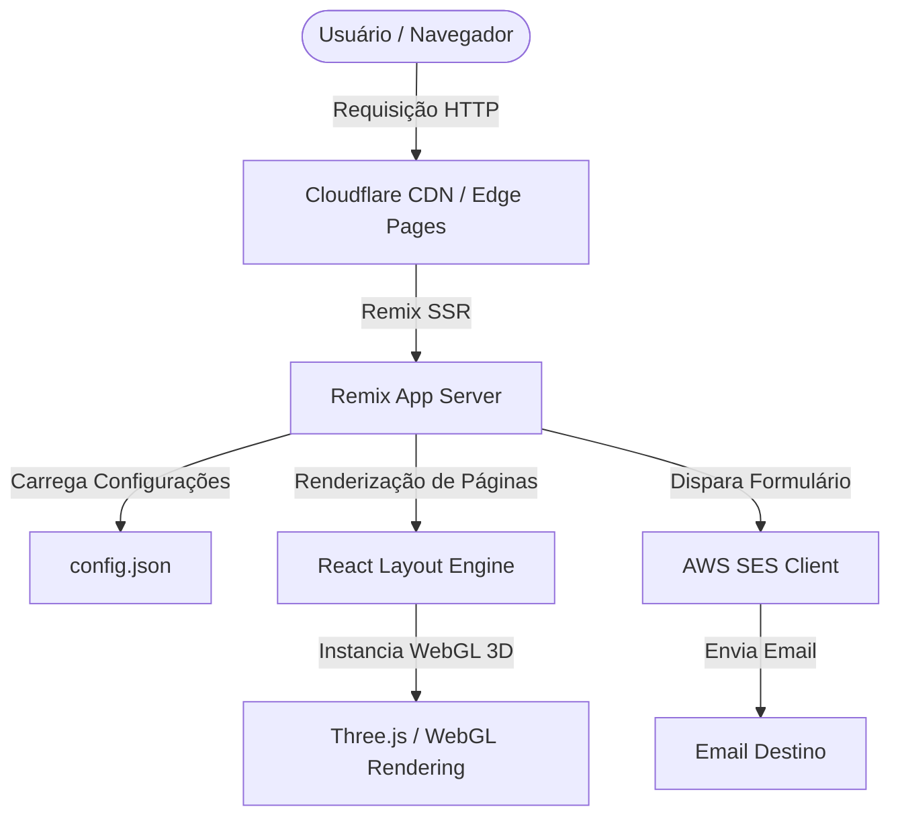
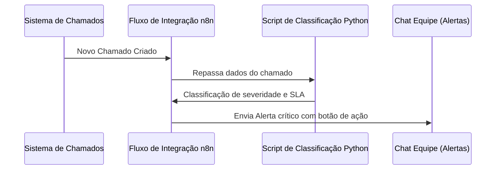

# Documentação Técnica - Portfólio & Plataforma de TI

Esta documentação técnica descreve a arquitetura, as tecnologias, as integrações, os fluxos de automação e os processos operacionais contidos na aplicação de portfólio de **Wanderson Guimarães**. O objetivo deste documento é fornecer uma visão clara e detalhada para engenheiros de software, administradores de sistemas e desenvolvedores que venham a manter ou evoluir este ecossistema.

---

## 1. Objetivo da Aplicação

A aplicação tem como finalidade servir como a central de apresentação profissional e portfólio de engenharia de Wanderson Guimarães. Ela foi projetada para expor de forma interativa, moderna e responsiva as principais competências em **Gestão de Operações de TI, Automações (Python/n8n), Infraestrutura de Redes e Integração de Sistemas**, demonstrando a resolução de problemas reais de negócios por meio de estudos de caso interativos (case studies) e renderizações em 3D.

---

## 2. Arquitetura do Sistema

A aplicação adota uma arquitetura moderna baseada em renderização híbrida no lado do servidor (SSR/Hydration) utilizando o framework **Remix** executado na infraestrutura Serverless de **Cloudflare Pages**.



### Principais Características da Arquitetura:
- **Serverless/Edge Edge Computing**: O Remix executa a lógica de servidor nas bordas da rede da Cloudflare, garantindo latências extremamente baixas globais.
- **Hydration Progressiva**: O HTML estrutural básico é servido pré-renderizado do servidor e as interações dinâmicas (como animações de texto do tipo *Decoder* e modelos 3D em Three.js) são hidratadas no lado do cliente.
- **Data-Driven Configuration**: A parametrização dos dados pessoais é concentrada em um arquivo JSON centralizado (`config.json`), desacoplando as informações estáticas do código de layout.

---

## 3. Tecnologias Utilizadas

A stack tecnológica do projeto é baseada em:

| Camada | Tecnologia | Finalidade |
| :--- | :--- | :--- |
| **Core Framework** | React v18 & Remix v2 | Gerenciamento de rotas, renderização SSR e componentização. |
| **Build Tool** | Vite v5 | Bundling rápido, Hot Module Replacement (HMR) e suporte a módulos ES. |
| **Plataforma Serverless** | Cloudflare Pages | Hospedagem de Assets estáticos e funções do lado do servidor (Remix Edge Server). |
| **Estilização (CSS)** | Vanilla CSS + PostCSS | Módulos CSS locais com variáveis globais compilados com custom media queries. |
| **3D Engine** | Three.js & Three-stdlib | Carregamento e renderização interactiva de modelos GLTF/GLB (Macbook Pro e iPhone). |
| **Animações** | Framer Motion v11 | Animações físicas baseadas em molas para transição de estados de layouts e menus. |
| **E-mail Integrator** | AWS SDK SES Client | Envio de mensagens de contato através de chaves seguras do Amazon Simple Email Service. |

---

## 4. Estrutura de Armazenamento de Dados

A plataforma funciona primariamente em modo **estático e parametrizado por arquivos**, não necessitando de bancos de dados relacionais pesados expostos na Web, aumentando a segurança digital e performance.

### JSON Schema do Arquivo `config.json`:
As principais chaves de dados do portfólio são declaradas conforme o modelo abaixo:
```json
{
  "name": "Nome Completo",
  "role": "Cargo Principal",
  "disciplines": [
    "Especialidade 1",
    "Especialidade 2"
  ],
  "url": "Link do Portfólio / LinkedIn",
  "linkedin": "ID do Perfil do LinkedIn",
  "github": "ID do Usuário do GitHub",
  "repo": "Link do Repositório do Código"
}
```

---

## 5. APIs e Integrações Externas

### 5.1 Integração de Email (Amazon SES)
O envio de mensagens na página `/contact` é gerenciado no lado do servidor pelo Remix no arquivo `app/routes/contact/contact.jsx`:
- **Protocolo**: HTTPS via AWS SDK.
- **Parâmetros Necessários** (Injetados via Cloudflare Environment Variables):
  - `AWS_ACCESS_KEY_ID`: ID da chave de acesso do IAM da AWS.
  - `AWS_SECRET_ACCESS_KEY`: Chave secreta do IAM da AWS.
  - `EMAIL`: Endereço de e-mail de destino (onde a mensagem será entregue).
  - `FROM_EMAIL`: Endereço de e-mail remetente verificado no console da AWS SES.

### 5.2 Redes Sociais & Links Rápidos
- **LinkedIn API/URL**: Redirecionamento dinâmico para o ID configurado no `config.json`.
- **GitHub Link**: Integração de botões com links públicos para os repositórios dos projetos do usuário.

---

## 6. Fluxos de Automação & Projetos Detalhados

A plataforma documenta três grandes processos corporativos reais:

### 6.1 Automações com Python & n8n
- **Processo**: Captura automática e priorização de chamados.
- **Funcionamento**: A plataforma n8n consome a API do sistema de chamados, identifica a severidade do incidente por inteligência de regras, dispara notificações push instantâneas no Teams/WhatsApp da equipe de suporte e atualiza o dashboard de relatórios lido de fontes SQL.



### 6.2 Integração PIX - Zanthus PDV
- **Processo**: Pagamento eletrônico dinâmico via QR Code no PDV.
- **Funcionamento**: Comunicação direta entre o sistema de caixa Zanthus PDV e a API do gateway de pagamento TEF (Sitef). O QR Code dinâmico com valor integrado é exibido na tela externa do cliente e a confirmação é recebida pelo caixa de forma síncrona.

### 6.3 Rede de Alta Disponibilidade
- **Processo**: Tolerância a falhas na rede industrial da Videplast.
- **Funcionamento**: Rede estruturada em topologia em anel usando fibras ópticas. Em caso de quebra em qualquer cabo físico, o protocolo de loop redundante gerencia o redirecionamento instantâneo do tráfego. Segmentação por VLANs garante isolamento de dados do ERP (Protheus/SAP) em relação ao CFTV.

---

## 7. Segurança e Autenticação

### 7.1 Honeypot de Spam
Para impedir o spam de bots no formulário de contato sem poluir o layout com captchas visuais desagradáveis, a aplicação implementa a validação por Honeypot:
- Um campo oculto via CSS (`name="name"`) é injetado no formulário.
- Usuários normais não enxergam e não preenchem o campo.
- Bots automatizados preenchem o campo oculto. Se o servidor Remix detectar que o campo contém qualquer texto, a requisição é cancelada imediatamente com retorno bem-sucedido falso (`success: true`), descartando o envio do email.

### 7.2 Sanitização de Entradas
Todas as strings de entrada de email e mensagens são validadas por Expressões Regulares (Regex) e limitadas a tamanhos máximos (`MAX_EMAIL_LENGTH = 512`, `MAX_MESSAGE_LENGTH = 4096`) no backend do Remix para mitigar ataques de injeção e estouro de buffer.

---

## 8. Guia de Instalação e Implantação

### Pré-requisitos
- Node.js (versão `>= 19.9.0`)
- Gerenciador de Pacotes `npm` ou `yarn`

### Passo a Passo para Execução Local:
1. Instale as dependências de desenvolvimento:
   ```bash
   npm install
   ```
2. Inicie o servidor de desenvolvimento local:
   ```bash
   npm run dev
   ```
3. Acesse a aplicação no endereço: [http://localhost:7777](http://localhost:7777).

### Compilação de Produção:
Gere a versão otimizada dos pacotes de arquivos:
```bash
npm run build
```

---

## 9. Guia de Manutenção e Atualização

### 9.1 Alterar Fotos de Perfil
Para atualizar a imagem principal exibida na seção "Sobre Mim":
1. Substitua os arquivos no diretório `app/assets/` com sua nova foto utilizando os mesmos nomes:
   - `profile.jpg` (tamanho padrão, idealmente proporção retrato 3:4).
   - `profile-large.jpg` (versão de alta definição).
   - `profile-placeholder.jpg` (versão de miniatura em baixa qualidade para carregamento progressivo).
2. Execute o comando `npm run build` para regerar a build de produção.

### 9.2 Adicionar Novas Tecnologias ou Sistemas
Edite a tabela de componentes da página de tecnologias no arquivo `app/routes/uses/uses.jsx`, alterando ou adicionando linhas dentro da tag `<TableBody>` utilizando os elementos `<TableRow>`, `<TableHeadCell>` e `<TableCell>` conforme as regras de design.
